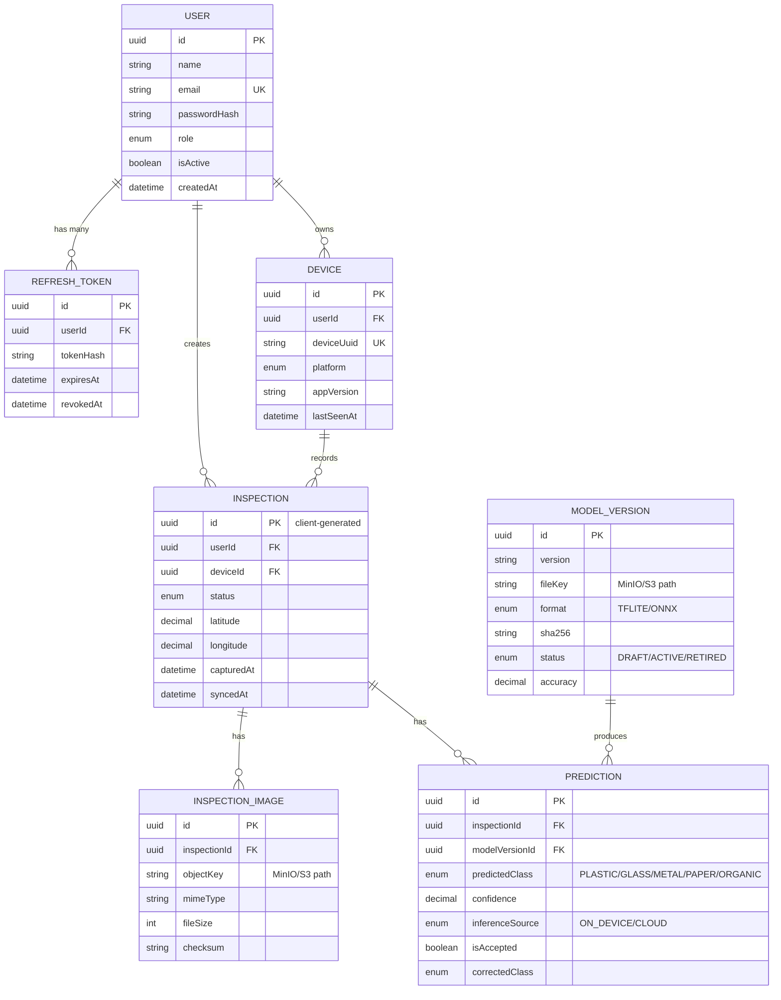

# FieldLens — Database schema sketch (Day 1)

This is the paper-sketch version of the schema, done before touching Prisma
(Day 2). Entities and relationships only — exact column types and
constraints will be finalised when the Prisma schema is written.

## Notes on key decisions (expand into ADRs when implemented on Day 2)

- **Inspection.id is client-generated (UUID), not an auto-increment
  integer.** The Flutter app creates inspections offline and must generate
  its own ID before it ever talks to the server. This is what makes the
  sync upsert idempotent later (Day 4).
- **Images are never stored in Postgres.** `InspectionImage` only stores a
  reference (`objectKey`) to where the file lives in MinIO/S3.
- **One Inspection can have multiple Predictions** — e.g. an on-device
  prediction, a cloud fallback, and a re-prediction after a model update.
- **RefreshToken is stored server-side** (hashed) so tokens can be revoked,
  rather than relying purely on JWT expiry.
